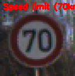
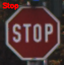
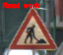

# Traffic-sign-recognition-system
System recogniges 43 different classes of traffic signs.

#### System was trained on GTSRB - German Traffic Sign Recognition Benchmark. link to dataset: https://www.kaggle.com/meowmeowmeowmeowmeow/gtsrb-german-traffic-sign

#### As images in dataset have low contrast, the Contrast Limited Adaptive histogram equalization (CLAHE) was used to improve contrast in images. 

#### Dataset is divided as: 1) 39,000 training images , 2) 12,000 validation images.

#### System comprises of three sets of CONV -> RELU -> BN -> POOL layers and 2 fully connected layers, system gained validation accuracy of 95%

#### Batchnormalization and dropout is used for scaling and regularization of data. 

#### Some examples of traffic signs predicted by system:
    

    

